# v3 Bootstrap 手册：从零起步的能力台阶
## v3 第 9 部分「渐进式实施路径」的前置补充

> **本手册定位**：v3.md 第 9 部分的实施路径假设"组织已有 AI 编码使用 + 缺差异化治理"。本手册补的是更前一步——**零代码 / 零 CI / 零 manifest / 零 Harness** 的 greenfield 起步路径。走通本手册的 P0-P7 八阶段、35 个能力后，项目方可进入 v3 第 9 部分阶段一。

---

## 0. 文档定位 + 适用边界

### 是什么
- 起步路径手册 + 35 项能力清单 + 系统组合视图
- 给 v3 第 9 部分提供"前置地基"的具体可操作步骤
- 阶段化（不依赖时间承诺）

### 不是什么
- 不是规范（无强制要求）
- 不是最佳实践宣言
- 不是 v3.md 替代

### 适用前提
- 项目处于 0 → 0.5 阶段（无框架、无 CI、无 manifest、无静态守卫）
- 决心引入 v3 治理思想，但缺地基
- 单人或团队（10 人内最贴合，10-30 人可适配，30+ 人组织通常已有内部平台不需要本手册）

### 不适用场景
- 一次性脚本 / 研究代码（治理 ROI 倒挂）
- 已有完整框架 + CI + 看板（直接进入 v3 第 9 部分阶段一）
- 强监管行业核心交易系统（监管约束 > 本手册）

### 关键认知（保留 v3 反思精神）
- 本手册仍是**探索性**——基于 v3（探索性理论）+ 现有工具的组合推荐
- **真实采用者的实践证据 > 本手册推荐**
- 每条工具给"为什么选 + 替代方案"，不做"最佳"宣言
- 本手册自身也要被治理（详见第 8 章）

---

## 1. 设计原则 + 阶段 vs 时间的辨析

### 4 条设计原则
1. **阶段（Phase）替代时间** —— 时间承诺假，能力达成真
2. **入口/出口信号必须客观可观察** —— 不靠主观判断
3. **能力为主体、工具为细节** —— 每个能力用 5 字段标准模板展开
4. **保留反思精神** —— 本手册仍可被实践推翻

### 时间假在哪

| 维度 | 真实差异 | 时间承诺如何失真 |
|---|---|---|
| 团队规模 | 单人 vs 5 人 vs 30 人 | 同阶段时长差 5-10 倍 |
| 工具熟悉度 | 第一次接触 vs 资深 | 学习曲线 1-4 周不等 |
| 并行度 | 全职 vs 兼职 vs 业余 | 实际投入差 3-5 倍 |
| 需求变化 | 稳定 vs 波动 | 中途返工拖延 50-200% |
| 历史债务 | greenfield vs 半遗留 | 清理工作量不可预估 |

**结论**：写"4 周完成 P1"在第 5 周就破产，引发治理失信。改写"P1 出口 = 5 个能力都达成"才可执行可验证。

### 阶段真在哪

每阶段含三件事，全是客观可观察的事件：
- **入口信号**：上一阶段全部出口达成（机器可验证）
- **必建能力**：每能力按"为什么 / 做什么 / 系统编织 / 出口标准 / 实现工具"五字段展开
- **出口信号**：可验证事件（"故意越界 PR 被 CI 拦住" / "DORA 五指标 daily 有数据"）

**唯一禁止跳阶**——前阶段未达出口直接跑下阶段，会形成基础不稳的脆弱叠加。

### 阶段间的并行规则
- **P0-P2 严格门控**（地基层，必须串行）
- **P3 + P4 可并行**（指标 vs 流程，互不干扰）
- **P5 可在 P4 中段开始**（DORA 数据可作 AI 输入）
- **P6 必须在 P5 出口后启动**（runtime agent 需 Harness 配置就位）
- **P7 是 hand-off**，宣告本手册结束

---

## 2. 全能力架构图

35 个能力分布在 P0-P6 七个阶段。下图展示能力间的依赖与数据流——同色子图为同一阶段，箭头表示"被依赖 / 数据流向"。

```mermaid
flowchart TD
    subgraph P0["P0 · Bootstrap"]
        direction LR
        P0_1["0.1 仓库 + 第一条 CI"]
        P0_2["0.2 hello-world 主路径"]
        P0_3["0.3 决策记录 ADR"]
        P0_4["0.4 协作约定"]
        P0_5["0.5 Code review 制度"]
    end

    subgraph P1["P1 · Boundary"]
        direction LR
        P1_1["1.1 领域分层"]
        P1_2["1.2 模块 manifest + lifecycle"]
        P1_3["1.3 静态边界守卫"]
        P1_4["1.4 API 版本策略"]
        P1_5["1.5 DB migration"]
    end

    subgraph P2["P2 · Quality Gate"]
        direction LR
        P2_1["2.1 多层漏洞扫描"]
        P2_2["2.2 测试覆盖率门禁"]
        P2_3["2.3 依赖自动升级"]
        P2_4["2.4 Secrets + 凭证轮转"]
        P2_5["2.5 配置 + flag 起步"]
        P2_6["2.6 数据合规标注"]
    end

    subgraph P3["P3 · Observability"]
        direction LR
        P3_1["3.1 OTel 三件套"]
        P3_2["3.2 SLI/SLO + budget"]
        P3_3["3.3 事件管理"]
        P3_4["3.4 性能基线 + 预算"]
        P3_5["3.5 a11y / i18n 基线"]
    end

    subgraph P4["P4 · Flow"]
        direction LR
        P4_1["4.1 DORA 五指标"]
        P4_2["4.2 看板 + WIP"]
        P4_3["4.3 Retrospective"]
        P4_4["4.4 Blameless post-mortem"]
        P4_5["4.5 VSM"]
    end

    subgraph P5["P5 · AI Augmentation"]
        direction LR
        P5_1["5.1 Harness 五件套"]
        P5_2["5.2 AI 接受率统计"]
        P5_3["5.3 健康度三维评分"]
        P5_4["5.4 AI 决策审计起步"]
    end

    subgraph P6["P6 · Declarative"]
        direction LR
        P6_1["6.1 Flag 系统化"]
        P6_2["6.2 IaC + GitOps"]
        P6_3["6.3 Runtime agent + R1-R5"]
        P6_4["6.4 Reconciliation loop"]
        P6_5["6.5 决策审计存储升级"]
        P6_6["6.6 Chaos eng (可选)"]
    end

    P0_1 --> P1_2
    P0_5 --> P1_3

    P1_2 --> P2_1
    P1_2 --> P5_3
    P1_2 --> P6_4
    P1_3 --> P5_3
    P1_4 --> P6_1
    P1_5 --> P2_4

    P2_1 --> P5_3
    P2_2 --> P5_3
    P2_5 --> P6_1
    P2_6 --> P3_1

    P3_1 --> P3_2
    P3_1 --> P5_3
    P3_2 --> P3_3
    P3_4 --> P5_3

    P4_1 --> P5_3
    P4_2 --> P4_1

    P5_1 --> P6_3
    P5_3 --> P6_4
    P5_4 --> P6_5

    P6_3 --> P6_4
    P6_4 --> P6_5

    classDef p0 fill:#fef3c7,stroke:#d97706,color:#000
    classDef p1 fill:#dbeafe,stroke:#2563eb,color:#000
    classDef p2 fill:#fee2e2,stroke:#dc2626,color:#000
    classDef p3 fill:#d1fae5,stroke:#059669,color:#000
    classDef p4 fill:#e0e7ff,stroke:#4f46e5,color:#000
    classDef p5 fill:#fce7f3,stroke:#db2777,color:#000
    classDef p6 fill:#f3e8ff,stroke:#9333ea,color:#000

    class P0_1,P0_2,P0_3,P0_4,P0_5 p0
    class P1_1,P1_2,P1_3,P1_4,P1_5 p1
    class P2_1,P2_2,P2_3,P2_4,P2_5,P2_6 p2
    class P3_1,P3_2,P3_3,P3_4,P3_5 p3
    class P4_1,P4_2,P4_3,P4_4,P4_5 p4
    class P5_1,P5_2,P5_3,P5_4 p5
    class P6_1,P6_2,P6_3,P6_4,P6_5,P6_6 p6
```

### 图的核心结构

**3 条主干**：
- **声明式主干**：1.2 manifest → 5.3 健康度 → 6.4 reconciliation
- **可观测主干**：3.1 OTel → 3.2 SLO → 3.3 事件管理
- **AI 主干**：5.1 Harness → 6.3 runtime agent → 6.4 被 reconciler 调用

**3 个汇聚点**：
- **5.3 健康度评分**：被 1.2 / 1.3 / 2.1 / 2.2 / 3.1 / 3.4 / 4.1 七路汇入 —— P5 核心
- **6.4 Reconciliation loop**：被 1.2 / 5.3 / 6.3 汇入 —— P6 核心
- **6.5 决策审计存储**：被 5.4 / 6.4 汇入 —— 审计真相源

---

## 3. 阶段 P0-P7 详述

### 能力的标准段落（5 字段）
每个能力按统一模板呈现：
- **为什么需要**：解决什么问题
- **做什么**：具体形态
- **系统编织**：与其他能力如何配合（前后阶段接口）
- **出口标准**：怎么算建立了
- **实现工具**：1 行带过，详见附录 A

---

### P0 · Bootstrap：项目能跑

**入口信号**：决定要做这个项目（单人立项 / 团队 kickoff 完成）

#### 0.1 · 仓库 + 第一条 CI
- **为什么需要**：没有版本控制 + 自动验证，所有后续治理无附着点
- **做什么**：建立 git 仓库 + 一条 push/PR 触发的 CI workflow（lint + test + build）
- **系统编织**：作为后续所有 CI 流水线（P1 守卫 / P2 扫描 / P4 DORA）的扩展基底；CI 全绿是 P5 评估循环的最早事件信号
- **出口标准**：CI 全绿持续 4 PR；任何 push/PR 自动跑 < 5 min
- **实现工具**：GitHub Actions / Azure Pipelines / GitLab CI

#### 0.2 · hello-world 主路径
- **为什么需要**：项目可运行是后续一切的基础；无 hello-world 证明栈选错都不知道
- **做什么**：建立从入口到对外接口的最短路径（如 HTTP server 一个端点 / CLI 一个命令）
- **系统编织**：是 P3 OTel 埋点的最早样本；是 P5 AI 评估循环的起点
- **出口标准**：main 分支可一键运行 hello-world；新成员从 clone 到运行 < 5 分钟
- **实现工具**：栈原生 + 可选 Docker

#### 0.3 · 决策记录 ADR
- **为什么需要**：早期决策（栈选 / 架构方向 / 工具选）半年后无人记得，复盘失去依据
- **做什么**：建立 docs/adr/ 目录 + 第一份 ADR（"为什么选这个栈"）+ ADR 模板
- **系统编织**：→ P5.1 AI Harness 的"项目记忆"层；→ P4 季度评审的历史输入
- **出口标准**：第一份 ADR 存在；后续重大决策走 ADR 流程
- **实现工具**：adr-tools / Log4brains / 手写 markdown

#### 0.4 · 协作约定
- **为什么需要**：没有"如何贡献"约定，PR 审查靠口头共识，团队 ≥ 2 人即崩
- **做什么**：README（项目意图 + quickstart）+ CONTRIBUTING（5 行：分支 + commit msg + PR 流程）+ branch protection 规则
- **系统编织**：→ 0.5 Code review 的依据；→ P5.1 AI Harness 的协作上下文（CLAUDE.md/cursor 规则可引用）
- **出口标准**：新成员从仓库到第一份 PR < 1 小时；branch protection 对 main 强制
- **实现工具**：GitHub Branch Protection / Azure DevOps Branch Policies / Conventional Commits

#### 0.5 · Code review 制度
- **为什么需要**：单纯 lint 不能拦设计错误；review 是知识传递与边界守卫的人侧动作
- **做什么**：CODEOWNERS + 必须 reviewer 数（≥ 1 或 ≥ 2）+ stale PR 自动关闭（≥ 30 天无活动）
- **系统编织**：→ P5.2 AI 接受率统计的对比基线（人工 review vs AI review）；→ P4.1 DORA Lead Time 的关键瓶颈点
- **出口标准**：所有 PR 至少 1 reviewer approve；CODEOWNERS 覆盖所有目录
- **实现工具**：CODEOWNERS（GitHub/GitLab/Azure 通用）+ stale-bot / Probot

**P0 能力间编织**：0.1 仓库与 CI 是物理基底，0.2 hello-world 验证栈选可行，0.3 ADR 把选型决策固化进项目记忆，0.4 协作约定与 0.5 review 制度共同构成"PR → main 之间的人/机协作通道"。这条通道在 P1-P6 会持续被加固（守卫加规则、扫描加层数、AI 加建议），但底盘永远是 P0 这五条。

**P0 出口信号**：CI 全绿 + main 分支可运行 hello-world + 第一份 ADR + README+CONTRIBUTING+CODEOWNERS 齐全

**P0 反模式**：第 1 周建 12 层 Clean Architecture / CI 第一天 12 个 step / 跳过 ADR / CODEOWNERS 全设为同一人（架空）

**团队规模差异**：单人 = GitHub Free 全套；小团队 = + branch protection 强制；中团队 = GitHub Enterprise / Azure DevOps Server

---

### P1 · Boundary：边界清晰

**入口**：P0 出口达成

#### 1.1 · 领域分层
- **为什么需要**：单一 src/ 目录会演变为大泥球；后续静态守卫无对象
- **做什么**：建立至少三档分层（domain / shared / adapters），每档有清晰职责
- **系统编织**：→ 1.2 manifest 按领域组织；→ 1.3 守卫规则的目标
- **出口标准**：每个文件可归属唯一一档；交叉引用走明确接口
- **实现工具**：栈原生目录约定（无专门工具）

#### 1.2 · 模块 manifest + lifecycle
- **为什么需要**：v3 整个声明式治理体系的基石。无 manifest = 无法机器化判断模块状态
- **做什么**：每模块一份 manifest.yaml（含 module/domain/lifecycle/contracts）+ JSON Schema 校验 + lifecycle 字段（experimental → candidate → asset → maintenance → retired）
- **系统编织**：被 P2.1（漏洞扫描分模块）/ P5.3（健康度按 manifest 索引）/ P6.4（reconciler 拉 manifest 算 drift）三方消费。**这是全图最重要的产出物**
- **出口标准**：100% 模块有 manifest；CI 强制 schema 校验；manifest 错误必 fail
- **实现工具**：JSON Schema + ajv / gojsonschema / jsonschema / NJsonSchema

#### 1.3 · 静态边界守卫
- **为什么需要**：仅靠 review 防越界，半年必崩。需要机器化拦截
- **做什么**：至少一条规则拦截致命越界（"跨域 import" / "experimental 被 production journey 引用" / "adapter 被 domain 直接调用"等）
- **系统编织**：→ P5.3 健康度结构得分子项；违反数即结构得分倒扣的输入
- **出口标准**：故意写越界 PR 被 CI fail；规则数 ≥ 3 条（团队规模相关）
- **实现工具**：dependency-cruiser / 自写 archtest / ArchUnit / NetArchTest / import-linter

#### 1.4 · API 版本策略
- **为什么需要**：第一版 API 不带版本号，未来无法平滑演进；客户端无 deprecation 路径
- **做什么**：所有对外 API 走 /api/v1/ 前缀；制定 deprecation policy（至少 2 个 release 双跑）
- **系统编织**：→ P6.1 Feature flag 系统化时按版本路由；→ P3.4 性能基线按版本对比
- **出口标准**：所有路由有 version 段；至少 1 条 deprecation 流程文档
- **实现工具**：OpenAPI 3 + Swagger UI / Redoc / Stoplight

#### 1.5 · DB migration
- **为什么需要**：直接改 schema 必演变为生产事故；版本不一致导致跨服务联调失败
- **做什么**：所有 schema 变更走 migration 工具；migrations 目录 + CI 校验顺序与可回滚性
- **系统编织**：→ P2.4 Secrets（migration 用 db 凭证）；→ P3.3 事件管理（schema 变更是 incident 高发源）
- **出口标准**：migrations/ 目录存在；至少 1 次成功的 forward + rollback 演练
- **实现工具**：Flyway / Liquibase / Alembic / golang-migrate / EF Core Migrations / Prisma Migrate

**P1 能力间编织**：1.1 领域分层是物理基础，1.2 manifest 把"模块 = 领域 + lifecycle"显式化，1.3 守卫拦截越界（基于 1.1 拓扑 + 1.2 lifecycle），1.4 API 版本与 1.5 DB migration 把"对外契约 + 数据形态"也纳入版本管理。**P1 出口意味着所有"代码 / 接口 / 数据"都进入了可治理状态**。

**P1 出口信号**：5 个能力出口全部达成；故意越界 PR 被 CI 拦；100% 模块有 manifest；migration 演练成功

**P1 反模式**：manifest 字段全靠人填 / lifecycle 全标 asset / 守卫只 1 条且永远不 fail / API 无版本号 / schema 直接改

**团队规模差异**：单人 = 1-2 守卫规则；小团队 = 3-5 条；中团队 = 边界规则评审机制 + 新规则需 ADR

---

### P2 · Quality Gate：质量门禁

**入口**：P1 出口

#### 2.1 · 多层漏洞扫描
- **为什么需要**：依赖漏洞、代码模式漏洞、数据流漏洞、物料清单各有盲区，单层不足以覆盖供应链攻击面
- **做什么**：建立 4 层独立扫描——依赖（CVE 库）+ 模式 SAST（已知不安全模式）+ 数据流 SAST（污点分析）+ SBOM（物料清单）
- **系统编织**：扫描结果 → P5.3 健康度结构得分子项；生产事件可反向追溯（P3 traceability）
- **出口标准**：4 层全绿持续 4 周；任一层中断有明确 owner
- **实现工具**：Dependabot + CodeQL + Semgrep + Syft

#### 2.2 · 测试覆盖率门禁
- **为什么需要**：覆盖率不是质量本身，但低覆盖率必有质量问题
- **做什么**：仅对新增代码设覆盖率门禁（避免 fake test 灌存量陷阱）
- **系统编织**：→ P5.3 工程信号源之一；与 P4.1 DORA Lead Time 共同衡量"快而稳"
- **出口标准**：覆盖率有 ≥ 4 周趋势数据；新增代码覆盖率 ≥ 80%
- **实现工具**：Codecov / Coveralls / SonarCloud

#### 2.3 · 依赖自动升级
- **为什么需要**：依赖会过期、出漏洞、被弃用。手动跟进是 toil 且必漏
- **做什么**：开 Dependabot/Renovate 自动 PR；制定升级合并节奏（如 weekly batch）
- **系统编织**：→ 2.1 漏洞扫描的修复路径；避免 Dependabot 噪声堆积
- **出口标准**：Dependabot PR 平均存活 < 7 天；无 ≥ 30 天积压 PR
- **实现工具**：Dependabot（GitHub 内置）/ Mend Renovate / Snyk

#### 2.4 · Secrets + 凭证轮转
- **为什么需要**：明文 secret 进 git 是常态事故；不轮转的凭证一旦泄露永久暴露
- **做什么**：secrets 集中管理 + 应用读 secrets 走 SDK + pre-commit + push-time 双层扫描 + 定期轮转
- **系统编织**：→ 1.5 DB migration 用的凭证；→ 6.2 IaC 中的 cloud 凭证
- **出口标准**：0 次明文 secret 进 git ≥ 4 周；至少 1 次成功轮转演练
- **实现工具**：HashiCorp Vault / Azure Key Vault / Doppler / AWS Secrets Manager + gitleaks / GitHub Secret Scanning

#### 2.5 · 配置 + Feature flag 起步
- **为什么需要**：配置写死在代码里 = 每次改配置都要发布；feature flag 是后续 progressive delivery 的基础
- **做什么**：env / config 分离 + feature flag SDK 起步（即使是简单 env 开关）+ 制定 flag 清理策略
- **系统编织**：→ 6.1 Flag 系统化 + canary delivery；→ 6.4 reconciler 用 flag 做实验态切流
- **出口标准**：第一个 feature flag 跑通；config 变更不需要重新构建
- **实现工具**：Flipt / Unleash（OSS） / LaunchDarkly / ConfigCat

#### 2.6 · 数据合规标注
- **为什么需要**：GDPR/HIPAA/PCI-DSS 等合规要求字段级追踪；事后补做需重审全部代码
- **做什么**：在 manifest 或 schema 标注敏感字段（PII / PHI / PCI），CI 校验"敏感字段不进日志/不出域"
- **系统编织**：→ P3.1 OTel（日志中过滤敏感字段）；→ P5.4 决策审计（标注敏感操作）
- **出口标准**：敏感字段标注覆盖率 ≥ 设定比例；CI 拦住"敏感字段写日志"PR
- **实现工具**：自建标注 + Semgrep custom rules / OpenPolicyAgent / Bridgecrew

**P2 能力间编织**：2.1 + 2.3 共同覆盖供应链安全（扫描发现 + 自动升级修复），2.2 用覆盖率约束新增代码质量，2.4 + 2.5 + 2.6 共同管理"敏感数据"（凭证 / 配置 / 合规字段）。**P2 出口意味着代码合入主干前已穿过 4-6 层独立门禁**。

**P2 出口信号**：6 个能力出口达成；4 层扫描全绿 ≥ 4 周；覆盖率有趋势；0 secret 进 git；feature flag 起步

**P2 反模式**：全仓 80% 覆盖率门禁逼出 fake test / Dependabot PR 堆积无人合 / Secrets 选错粒度（每 service 都连 Vault 但只 3 个 secret）/ feature flag 无清理（半年累积 200+ 永久 flag）

**团队规模差异**：单人 = Dependabot + CodeQL + Codecov 三件套；小团队 = + Snyk free / Semgrep + Flipt；中团队 = SonarCloud + Vault + LaunchDarkly

---

### P3 · Observability：可观测

**入口**：P2 出口（可与 P4 部分并行）

#### 3.1 · OpenTelemetry 三件套
- **为什么需要**：日志/度量/链路任一缺失，事件分析必有盲区；vendor lock-in 阻碍后期工具切换
- **做什么**：OTel SDK 统一埋点 + 结构化日志（JSON）+ 度量（counter/gauge/histogram）+ 链路追踪（trace_id 贯通服务间调用）
- **系统编织**：→ 3.2 SLO 计算 / 3.3 事件追踪 / 3.4 性能基线 / 5.3 健康度信号
- **出口标准**：trace_id 可贯通从入口到 DB 调用；3 件套都有数据
- **实现工具**：OpenTelemetry SDK + Grafana Cloud / DataDog / Application Insights / Honeycomb

#### 3.2 · SLI/SLO + Error budget
- **为什么需要**：没有 SLO = "可用性"是主观词；error budget 是约束发布速度的客观锚
- **做什么**：定义至少 1 条 SLI（如 P99 latency / 成功率）+ 1 个 SLO + error budget 跟踪
- **系统编织**：→ 3.3 SLO burn 触发事件；→ 4.1 DORA Change Failure Rate 与 budget 联动
- **出口标准**：SLO 已开始 burn（即开始记录违反）；budget 计算可见
- **实现工具**：Sloth（OSS）/ Pyrra（OSS） / Nobl9（商业）

#### 3.3 · 事件管理
- **为什么需要**：生产问题 0 响应 = 用户先于团队发现；on-call 集中在 1 人 = burnout 必至
- **做什么**：建立 on-call schedule + alert 通道 + incident 流程（detect → respond → resolve → review）+ runbook 库
- **系统编织**：← 3.2 SLO burn 触发；→ 4.4 blameless post-mortem 输入
- **出口标准**：on-call 有人；至少 1 次真实事件走完流程；runbook ≥ 3 份
- **实现工具**：PagerDuty free（5 user）/ Opsgenie / FireHydrant / 自建 + Slack 通知

#### 3.4 · 性能基线 + 预算
- **为什么需要**：没有基线，性能回归不可见；前端项目尤其 bundle size / LCP 必失控
- **做什么**：CI 集成性能测试 + 基线快照 + 性能预算（bundle size / LCP / API P99 阈值）+ 回归 fail
- **系统编织**：→ 5.3 工程得分子项；→ 1.4 API 版本对比基线
- **出口标准**：性能基线在 CI 持续跑；至少 1 次回归被拦
- **实现工具**：k6（API） / Lighthouse CI（前端） / JMeter / Gatling / NBomber

#### 3.5 · a11y / i18n 基线（用户面项目）
- **为什么需要**：a11y 后期补做需重审全部 UI；i18n 字符串硬编码后批量提取成本高
- **做什么**：a11y 自动检测（CI 集成）+ i18n 字符串外置（如 .po / .resx / json）+ 至少 1 个非默认语言验证
- **系统编织**：→ 3.4 性能预算（i18n 包体增长）
- **出口标准**：a11y 检测无 critical violation；i18n 框架就位
- **实现工具**：axe-core + Pa11y CI / Lighthouse a11y / WAVE；i18next / FormatJS / .NET ResX

**P3 能力间编织**：3.1 OTel 是数据基底，3.2 SLO 把 OTel 数据转为业务约束，3.3 事件管理把 SLO burn 转为人工响应，3.4 + 3.5 把"性能"与"可达性"也纳入持续观测。**P3 出口意味着系统状态对人 + 机器都可见**。

**P3 出口信号**：能从一条生产事件 trace_id 反向追溯到引入它的 PR；SLO 已 burn；on-call 有人

**P3 反模式**：三件套全装但没人看 / SLO 100% 永远不 burn / on-call 不轮换 / 性能基线只跑一次（应作为 CI 持续基线）

**团队规模差异**：单人 = Grafana Cloud free + Sentry free，自己 on-call；小团队 = + PagerDuty 排班；中团队 = DataDog/Application Insights 完整 stack + 专门 SRE

---

### P4 · Flow：流程内建

**入口**：P3 入口（可与 P3 并行）

#### 4.1 · DORA 五指标采集
- **为什么需要**：没有客观指标 = "我们效率高"是主观判断；DORA 是行业可比基线
- **做什么**：采集 deployment frequency / lead time / change failure rate / recovery time / rework rate；daily snapshot
- **系统编织**：← 4.2 WIP 直接影响 lead time；→ 5.3 健康度工程得分；→ P4 季度评审输入
- **出口标准**：5 指标 daily snapshot ≥ 4 周
- **实现工具**：自建（gh CLI + jq + cron）→ Apache DevLake → Sleuth / DX / DataDog DORA

#### 4.2 · 看板 + WIP 限制
- **为什么需要**：无 WIP = 任务并行无限 = 实际无任务真正完成；看板 + WIP 是流速的物理约束
- **做什么**：看板列（Backlog/Doing/Review/Done）+ Doing 列 WIP 上限（按团队规模与利特尔法则定）
- **系统编织**：→ 4.1 DORA Lead Time（WIP 越大 lead time 越长）
- **出口标准**：WIP 上限有数；超出会被自动告警或拒入列
- **实现工具**：GitHub Projects / Azure DevOps Boards / Linear / Jira

#### 4.3 · Retrospective 节奏
- **为什么需要**：没有定期回顾 = 同样的错误重犯；改进无积累
- **做什么**：每个里程碑结束跑 retro；输出有 owner 的 action item；下次 retro 跟进
- **系统编织**：← 4.4 post-mortem 输入；← 4.1 DORA 数据输入；→ ADR（重大改进固化为决策）
- **出口标准**：至少 1 次 retro 输出 action 并完成跟进
- **实现工具**：Miro / FunRetro / Metro Retro / Notion 模板

#### 4.4 · Blameless post-mortem
- **为什么需要**：incident 后追责 = 团队隐瞒下一次 incident；blameless 是组织学习的前提
- **做什么**：每次 incident 走 blameless post-mortem 模板（时间线 + 根因 + 行动）+ 公开归档
- **系统编织**：← 3.3 事件管理触发；→ 4.3 retro 输入
- **出口标准**：至少 1 次真实 post-mortem 公开存档；语气 blameless（无追责措辞）
- **实现工具**：Google SRE 模板 / PagerDuty Postmortems / 自建

#### 4.5 · Value stream mapping
- **为什么需要**：流程瓶颈靠拍脑袋找通常错；VSM 让"想法到生产"的等待时间可见
- **做什么**：至少做一次完整 VSM（idea → backlog → dev → review → deploy → 用户），标出每段等待时间
- **系统编织**：→ 4.1 DORA Lead Time 优化输入；→ 4.3 retro 改进对象
- **出口标准**：第一份 VSM 文档在 docs/operations/ 存档
- **实现工具**：Miro / draw.io / Lucidchart / Figjam

**P4 能力间编织**：4.1 DORA 给出客观指标，4.2 看板控制流速来源，4.3 retro 是改进引擎，4.4 post-mortem 是危机学习引擎，4.5 VSM 是流程诊断工具。**P4 出口意味着团队从"按感觉做事"切换到"按数据 + 仪式做事"**。

**P4 出口信号**：DORA daily ≥ 4 周；至少 1 次 retro+action 跟进；至少 1 次 blameless post-mortem；1 份 VSM

**P4 反模式**：看板无 WIP / Retro 无 action 跟踪 / Post-mortem 变追责 / DORA 通过调指标定义改善而非真实改进

**团队规模差异**：单人 = 自建 DORA + 自我 retro；小团队 = + Slack + DORA 脚本；中团队 = Linear / Azure Boards + DevLake + 专职 retro facilitator

---

### P5 · AI Augmentation：AI 协作系统化

**入口**：P4 中段（不必等 P4 完全出口）

#### 5.1 · Harness 五件套
- **为什么需要**：临时 prompt 无法跨 session 持久；Harness 是"AI 在项目中的工程外壳"
- **做什么**：建立 Anthropic 五件套——系统上下文（CLAUDE.md / cursor rules / copilot instructions）+ 工具约束（permissions）+ 上下文注入（rules/skills 文件）+ 记忆与进度（git log + ADR + memory 文件）+ 评估循环（CI 全绿 + eval suite）
- **系统编织**：→ 6.3 runtime agent 复用 Harness 配置；← 0.3 ADR 与 0.4 协作约定 是上下文输入
- **出口标准**：五件套都有具体文件；AI 在 PR 中能引用项目历史决策
- **实现工具**：Claude Code / Cursor / GitHub Copilot 选一

#### 5.2 · AI 接受率统计
- **为什么需要**：不知道 AI 建议被接受/拒绝率 = 无法判断 Harness 是否有效；崇拜 vs 失信都不可见
- **做什么**：在 PR 中标记 AI 来源（commit trailer / label）+ 统计 merge 率 vs 总数；周报给出趋势
- **系统编织**：← 0.5 Code review 制度（review 决定接受/拒绝）；→ P6.3 R1 自治阈值校准
- **出口标准**：接受率有 ≥ 4 周真实数据；既不在 100% 也不持续 < 30%
- **实现工具**：自建 git log 解析 + GitHub label 统计

#### 5.3 · 健康度三维评分
- **为什么需要**：模块"还被需要 / 还健康 / 还在边界内"必须可计算；否则全靠主观
- **做什么**：业务/结构/工程三维评分 + 机械化采集 + daily 快照 + 任一维 < 30 告警
- **系统编织**：被 1.2/1.3/2.1/2.2/3.1/3.4/4.1 七路汇入（**全图最重要的汇聚点**）；→ 6.4 reconciler 输入
- **出口标准**：3 cell 至少 1 个有非占位三维分；评分有 ≥ 4 周趋势
- **实现工具**：自建 shell/python 脚本 + 各上游工具 API（Codecov / archtest / sonar）

#### 5.4 · AI 决策审计起步
- **为什么需要**：AI 自主决策必须可追溯；否则 R1-R3 让渡时无法事后复盘
- **做什么**：每次 AI 触发的状态变更（lifecycle 迁移建议 / 自动 PR 等）写入 docs/agent-decisions/<date>.md，含触发器/动作/可逆性级别/回滚方式
- **系统编织**：→ 6.5 决策审计存储升级（结构化）；← 5.1 Harness 评估循环触发
- **出口标准**：决策审计 ≥ 30 条积累
- **实现工具**：append-only markdown + git log

**P5 能力间编织**：5.1 Harness 是 AI 的工程外壳，5.2 接受率统计校准 Harness 有效性，5.3 健康度评分是 AI 决策的输入数据，5.4 决策审计是 AI 输出的事后追溯。**P5 出口意味着 AI 在项目中"有上下文 / 有数据 / 有反馈 / 有审计"，进入可被治理状态**。

**P5 出口信号**：AI 接受率有 ≥ 4 周真实数据；健康度评分有趋势；决策审计 ≥ 30 条

**P5 反模式**：接受率 100%（崇拜）/ 接受率 < 30%（建议质量低）/ 三个 IDE harness 规则相互打架 / 决策审计无 evidence 引用

**团队规模差异**：单人 = Claude Code 一个；小团队 = Cursor Team 共享规则；中团队 = 分角色 agent + 评估 SaaS

---

### P6 · Declarative：声明式治理

**入口**：P5 出口

#### 6.1 · Feature flag 系统化
- **为什么需要**：P2.5 起步的 flag 需要升级为系统：targeting rules / segment / 渐进 rollout / 自动清理
- **做什么**：flag 服务化 + canary（1%→10%→50%→100%）+ shadow（对比新旧）+ flag 生命周期（创建/活跃/清理）
- **系统编织**：← 1.4 API 版本（按版本路由）；← 2.5 起步配置；→ 6.4 reconciler（实验态切流走 flag）
- **出口标准**：至少 1 次真实 canary 回滚验证；flag 清理流程有自动化
- **实现工具**：Flipt（OSS）/ Unleash（OSS）/ LaunchDarkly / ConfigCat

#### 6.2 · IaC + GitOps
- **为什么需要**：手动操作环境必引发 state drift；不可一键创建/销毁 = 无法测试 + 无法快速恢复
- **做什么**：所有基础设施走 Terraform/Pulumi/Bicep + state 中心化管理 + GitOps（git 是真相源，控制器自动同步）
- **系统编织**：→ 6.4 reconciler 借鉴 K8s controller 模式；← 2.4 Secrets（IaC 用云凭证）
- **出口标准**：环境一键创建 + 一键销毁；state drift 可检测
- **实现工具**：Terraform / Pulumi / OpenTofu / Bicep（Azure）+ ArgoCD / Flux / Azure Deployment Environments

#### 6.3 · Runtime agent + R1-R5 可逆性梯度
- **为什么需要**：v3 真正"运行时治理"的承诺。无 agent = 治理只在编译时
- **做什么**：建立 runtime/agent/ 抽象（AgentTask interface）+ executor 按可逆性 R1-R5 路由（R1 自治 / R2-R3 提议 + 人审 / R4-R5 阻塞）
- **系统编织**：← 5.1 Harness 配置；→ 6.4 被 reconciler 调用
- **出口标准**：R1 实验态 lifecycle 自动迁移在 dry-run 跑通
- **实现工具**：栈原生（Go time.Tick / Node node-cron / Python APScheduler / .NET IHostedService+Quartz / JVM @Scheduled）→ Temporal / Dapr（如规模大）

#### 6.4 · Reconciliation loop
- **为什么需要**：定期检查 desired vs current = 主动发现 drift；被动等用户报告 = 太晚
- **做什么**：定时 cron（如 30 min）拉 manifest + 算 drift + 按 R1-R5 路由修正 + 报告状态
- **系统编织**：被 1.2/5.3/6.3 汇入（**P6 核心**）；→ 6.5 决策审计存储
- **出口标准**：dry-run 多次零误判；R1 自治在 dry-run 跑通
- **实现工具**：自建 + GitHub Actions cron / 栈原生 scheduler / K8s Controller-runtime（如已上 K8s）/ Crossplane

#### 6.5 · 决策审计存储升级
- **为什么需要**：5.4 markdown 存储不支持结构化查询；规模化后必须升级
- **做什么**：append-only markdown → SQLite（中量）/ EventStoreDB（大量）；提供 query CLI
- **系统编织**：← 5.4 起步存储 / ← 6.4 reconciler 写入；→ P6 季度评审输入
- **出口标准**：决策可结构化查询（按时间/触发器/可逆性级别 filter）
- **实现工具**：SQLite / EventStoreDB / Postgres append-only table

#### 6.6 · Chaos engineering（可选）
- **为什么需要**：没有故障注入演练 = 不知道系统真实容错边界；真出事时必慌
- **做什么**：定期注入故障（依赖延迟 / 节点 down / 网络分区）+ 验证 SLO 是否仍达
- **系统编织**：→ 3.2 SLO 验证；→ 4.4 post-mortem 演练
- **出口标准**：至少 1 次成功的 chaos 实验 + 报告
- **实现工具**：Litmus / Chaos Mesh（K8s）/ Gremlin / 自建 fault injection

**P6 能力间编织**：6.1 flag 是渐进交付通道，6.2 IaC + GitOps 是部署声明式化，6.3 runtime agent 是 AI 真正的运行时入口，6.4 reconciliation 是闭环驱动器，6.5 决策审计存储是事后真相源，6.6 chaos 是主动验证。**P6 出口意味着系统进入"声明式 + 持续收敛 + 可审计"状态**——这是 v3 第 9 部分阶段二的入场券。

**P6 出口信号**：reconciler dry-run 零误判；R1 实验态自治跑通；feature flag 至少 1 次真实 canary 回滚；决策审计可结构化查询

**P6 反模式**：服务数 < 5 上 K8s / flag 无清理（半年累积 200+）/ reconciler 无 dry-run 直接生产 / IaC 与手动并存

**团队规模差异**：单人 = Cloud Run + Flipt + Terraform（不上 K8s）；小团队 = 托管 K8s + Helm + ArgoCD + Unleash；中团队 = 完整 GitOps + 服务网格 + Temporal/Dapr

---

### P7 · Hand-off：进入 v3 第 9 部分阶段一

**入口**：P6 出口

**动作**：
- 确认 v3 第 9 部分阶段一的入口条件（详见 v3.md 第 9 部分）
- 把 P0-P6 建立的 35 项能力作为 v3 阶段一/二/三的"地基"
- 本手册功成身退；后续按 v3 第 9 部分推进

**继续推进的方向**（v3 第 9 部分内容，不在本手册范围）：
- 阶段一：辅助判断的差异化门禁
- 阶段二：AI 自主权梯度从 L0 升到 L1
- 阶段三：R1-R3 可逆区有限自治
- 阶段四：远景，R5 永不让渡

---

## 4. 跨阶段反模式

| 反模式 | 症状 | 矫正 |
|---|---|---|
| 跳阶 | P1 未出口直接做 P3 | 严格门控：上阶段出口未达成不进入下阶段 |
| 一步到位 | P0 即上 K8s+Temporal+DataDog | 按 P0-P6 顺序，每阶段只做必备 |
| 工具撞栈 | 同时用 GitHub Projects+Linear+Jira | 每能力只选 1 个工具 |
| 信号填空 | 让人手填 manifest / 健康度信号 | 必须机械化采集 |
| AI 崇拜 | 接受率 100% 否决率 0 | 强制 ≥ 10% 否决率作为健康下限 |
| 治理 ROI 倒挂 | 治理时间 > 编码 30% 持续两个里程碑 | 暂停推进，重审本阶段范围 |
| 假覆盖率 | 全仓 80% 门禁逼出 fake test | 仅新增代码门禁 |
| 框架超前 | P0 即建 12 层 Clean Architecture | P0 只 3 层（domain / shared / adapters） |
| 跳过 v3 第 9 | P6 出口直接做 reconciliation 自治 | 必须经 v3 第 9 部分阶段一/二/三 |
| K8s 超前 | 服务数 < 5 上 K8s | Cloud Run / Container Apps 起步 |

---

## 5. 阶段倒退信号

如果出现下列情况，**回退到前一阶段重做**，而非继续推进：

- **倒退 P0**：仓库结构混乱到新成员 1 天内无法 onboard
- **倒退 P1**：故意越界 PR 居然过了 CI（守卫失效）
- **倒退 P2**：连续 2 周生产事件源于已知 CVE 但 Dependabot 未拦
- **倒退 P3**：生产事件无法定位（无 trace / SLO 永远不 burn）
- **倒退 P4**：DORA Lead Time 持续上升 3 个里程碑
- **倒退 P5**：AI 接受率持续 < 30% 或持续 > 95%
- **倒退 P6**：reconciler 误退役活跃模块 ≥ 1 次

倒退不是失败，是诚实——**继续往下走**会把基础不稳的脆弱叠加扩大化。

---

## 6. 每阶段验证清单

| 阶段 | 客观可验证清单 |
|---|---|
| P0 | [ ] CI 全绿；[ ] main 可运行；[ ] 第一份 ADR；[ ] README+CONTRIBUTING+CODEOWNERS |
| P1 | [ ] 越界 PR 被 CI 拦；[ ] 100% 模块 manifest+lifecycle；[ ] migration 演练通过 |
| P2 | [ ] 4 层扫描全绿 ≥ 4 周；[ ] 覆盖率有趋势；[ ] 0 secret 进 git；[ ] feature flag 起步；[ ] 数据合规标注覆盖 |
| P3 | [ ] trace_id 反追 PR；[ ] SLO 已 burn；[ ] on-call 有人；[ ] 性能回归被拦过 |
| P4 | [ ] DORA daily ≥ 4 周；[ ] retro 跑过 1 次有 action；[ ] post-mortem 写过 1 次；[ ] VSM 文档 |
| P5 | [ ] AI 接受率 ≥ 4 周真实数据；[ ] 健康度评分有趋势；[ ] 决策审计 ≥ 30 条 |
| P6 | [ ] reconciler dry-run 零误判；[ ] R1 自治跑通；[ ] flag canary 回滚验证 |
| P7 | [ ] 上述全部达成 → 进入 v3 第 9 部分阶段一 |

---

## 7. 与 v3 第 9 部分的对接

P7 之后，本手册的 35 项能力全部就位，对应 v3 第 9 部分阶段一的"入口条件"已超额满足。

**对接点**：
- v3 阶段一"入口 = AI 编码 + 缺差异化治理" → 本手册 P5 出口已超出
- v3 阶段一"出口 = 100% 模块 manifest + 差异化 CI 门禁稳定" → 本手册 P1+P6 已具备地基
- v3 阶段二"入口 = AI Agent 基础设施就位" → 本手册 P5 已就位

继续按 v3.md 第 9 部分推进即可。

---

## 8. 持续修订机制（本手册自身的治理）

本手册仍是**探索性文档**，必须接受实践质疑：

- 每个真实项目应用本手册时开 `bootstrap-feedback` issue（在该项目仓库内）
- 至少 3 个不同项目走过 P0-P7 后才考虑发布"v1"版本（在此之前是 v0.x 探索版）
- 每条工具推荐配实践证据（哪个项目用过 + 反馈），无证据的不进首选
- 每年至少 1 次审视：哪些工具下架（产品停服 / 被并购）、哪些新工具上架

**自治理红线**：
- ❌ 本手册声称自己是"最佳实践" → 删除该措辞，改回"探索性"
- ❌ 工具菜单 ≥ 6 个月未更新 → 触发审视
- ❌ 项目走完 P0-P7 但 v3 第 9 部分阶段一/二/三跑不通 → 反向修订本手册

---

## 附录 A · 工具菜单矩阵（5 栈 × 关键能力）

下表为 P0-P6 的工具速查。**首选 = 单人/小团队起步**，**升级 = 团队 ≥ 5 人或服务数 ≥ 5 时考虑**。

| 能力 | TS/Node | Go | Python | Java/Kotlin | .NET |
|---|---|---|---|---|---|
| 包/构建 | npm/pnpm + tsx / esbuild | go modules | poetry / uv | maven / gradle | dotnet sdk |
| Lint | ESLint | golangci-lint | ruff | Checkstyle / ktlint | Roslyn analyzers |
| Type | tsc strict | go vet+staticcheck | mypy | 编译器内置 | 编译器内置 |
| 静态守卫 | dependency-cruiser | 自写 archtest | import-linter | ArchUnit | NetArchTest |
| 测试 | Jest / Vitest | testing+testify | pytest | JUnit 5 | xUnit |
| 覆盖率 | c8 / Istanbul → Codecov | -cover → Codecov | pytest-cov → Codecov | JaCoCo → Codecov | coverlet → Codecov |
| 依赖漏洞 | npm audit + Dependabot | govulncheck + Dependabot | pip-audit + Dependabot | OWASP DC + Dependabot | dotnet vulnerable + Dependabot |
| DB migration | Prisma Migrate / Knex | golang-migrate | Alembic | Flyway / Liquibase | EF Core Migrations |
| 性能基线 | k6 / Artillery / Lighthouse CI | k6 | Locust / k6 | JMeter / Gatling | NBomber / k6 |
| BDD | Cucumber.js | godog | behave | Cucumber-JVM | SpecFlow |
| Runtime agent | node-cron / BullMQ | time.Tick / robfig/cron | APScheduler / Celery | @Scheduled / Quartz | IHostedService + Quartz.NET |

**通用层**（不分栈）：

| 能力 | 起步首选 | 升级 |
|---|---|---|
| 仓库 + CI/CD + 看板 | GitHub（一站式）| Azure DevOps（Boards/Pipelines/Repos/Artifacts/Test Plans 五件套，企业 .NET 友好）|
| 漏洞 SAST | CodeQL（GitHub）/ Semgrep | SonarCloud / Snyk |
| 容器 | Docker | Buildah / nerdctl |
| 编排 | Cloud Run / Container Apps / ECS Fargate / 直接 systemd | Kubernetes（EKS / AKS / GKE） |
| IaC | Terraform | Pulumi / OpenTofu / Bicep（Azure） |
| GitOps | ArgoCD | Flux / Azure Deployment Environments |
| Telemetry | OpenTelemetry SDK + Grafana Cloud free | Application Insights / DataDog / New Relic / Honeycomb |
| Feature flag | Flipt / Unleash（OSS） | LaunchDarkly |
| Secrets | HashiCorp Vault / Azure Key Vault | Doppler / AWS Secrets Manager |
| AI Harness | Claude Code / Cursor / Copilot 选一 | 多角色 agent 分离 |
| DORA 采集 | 自建脚本 | Apache DevLake / Sleuth / DX |
| 事件管理 | PagerDuty free | Opsgenie / FireHydrant |

**Kubernetes 引入时机**：
- 单人 / 小团队 / 服务数 < 5：**不要上 K8s**，用 Cloud Run / Azure Container Apps / ECS Fargate / VM systemd
- 中团队 / 服务数 5-30：考虑托管 K8s（EKS / AKS / GKE）
- 大团队 / 服务数 30+：托管或自管 K8s，按需引入服务网格

---

## 附录 B · 单人 / 小团队 / 中团队 工具差异化

| 能力 | 单人 | 小团队（2-5）| 中团队（5-30）|
|---|---|---|---|
| 仓库+CI | GitHub Free | GitHub Team / Azure DevOps Basic | GitHub Enterprise / Azure DevOps Server |
| Issue+看板 | GitHub Issues+Projects | + Linear / Azure Boards | Linear / Jira / Azure Boards Pro |
| 通讯 | – | Slack free / Teams | Slack paid + PagerDuty |
| 漏洞 | Dependabot+CodeQL | + Snyk free / Semgrep | + Snyk team / SonarCloud |
| 覆盖率 | Codecov free | Codecov team | SonarCloud |
| Telemetry | Grafana Cloud free | + Sentry free | DataDog / Application Insights / New Relic |
| Secrets | Vault OSS / 1Password | Doppler / Vault Cloud | Vault Enterprise / AWS SM / Azure Key Vault |
| Feature flag | Flipt OSS / env 开关 | Unleash OSS | LaunchDarkly |
| AI Harness | Claude Code 个人 | Cursor Team / Claude for Teams | Cursor Enterprise / 自建评估 |
| Runtime | Cloud Run / Container Apps | 托管 K8s（如需）| 完整 K8s + 服务网格 |
| DORA | 自建脚本 | Apache DevLake | DevLake / Sleuth / DX |
| 决策审计 | append-only markdown | + SQLite | EventStoreDB / Postgres |
| 事件管理 | PagerDuty free（自己 on-call）| PagerDuty 5-user free | Opsgenie / FireHydrant |

**升级原则**：每升一档，**只换最痛的 1-2 个工具**。一次性换 5 个工具会导致团队工作流崩溃 4-6 周。

---

## 相关文档

- [v3 方法论原文](v3.md)
- [Anthropic Harness 五件套](https://www.anthropic.com/engineering/effective-harnesses-for-long-running-agents)
- [DORA 官方报告](https://dora.dev/)
- [Apache DevLake](https://devlake.apache.org/)
- [Kubernetes 官方文档](https://kubernetes.io/docs/)
- [Azure DevOps 文档](https://learn.microsoft.com/en-us/azure/devops/)
- [OpenTelemetry](https://opentelemetry.io/)
- [Google SRE Books](https://sre.google/books/)
- [CycloneDX SBOM](https://cyclonedx.org/) / [SPDX](https://spdx.dev/)
